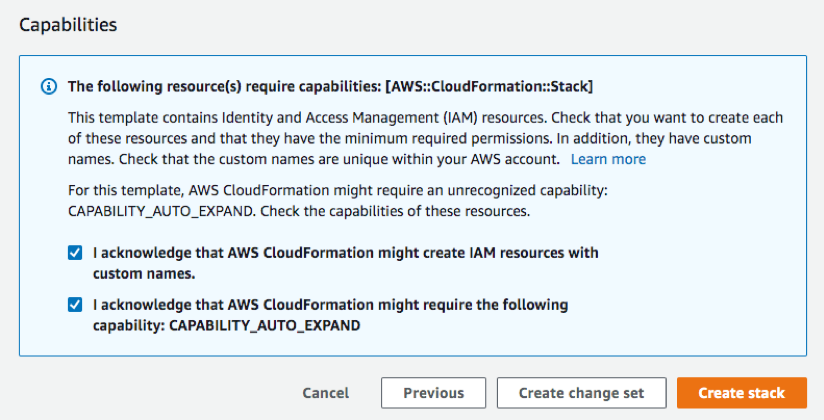
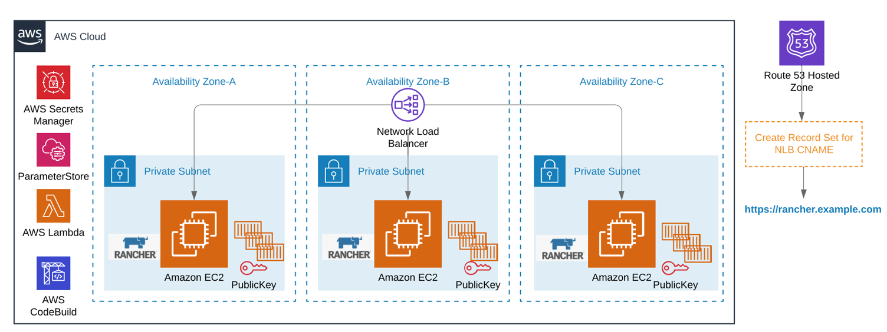

# High Availability Rancher - The Automated Way!

Rancher is an open source application developed for the sole purpose of reducing the complexity of managing multiple Kubernetes (K8s) clusters across various platforms. It enables DevOps engineers a single pane of glass to control K8s clusters wherever they may be, whether it be on-premise or in various cloud providers.

Today, I'm going to show you how to leverage the power of Rancher in a multi account AWS environment to control your K8s clusters both on EKS and EC2 machines. I will show you how to implement Rancher in a highly available way across multiple availability zones to meet your well-architected requirements. We will be deploying Rancher into an AWS account with 3 nodes spanning across several availability zones in our private subnets behind a network load balancer.

Let's get started!

## Initial Setup:

In this post we will be using the [Rancher Kubernetes Engine (RKE)](https:/rancher.com/docs/rke/latest/en/) to simplify the installation complexity of setting up Kubernetes. This of course can be done in various ways, either by using your own laptop and following step by step installation instructions or on an EC2 server itself. However, if your using a laptop or server you need to install various packages like RKE, [Kubectl](https:/kubernetes.io/docs/reference/kubectl/overview/) and [Helm](https:/helm.sh/) in a manual fashion, which of course needs to be completed in a sequential order. My preference was to leverage native AWS services like [CodeBuild](https://aws.amazon.com/codebuild/), [Lambda](https://aws.amazon.com/lambda/), and [SecretsManager](https://aws.amazon.com/secrets-manager/) to not only install the required packages that we need but to successfully and securely install the Rancher services across multiple EC2 machines in an automated way. 

## Breakdown of the AWS services involved


The installation logic shown here illustrates the necessary steps involved when the automation kicks off. For example, RKE has a requirement to be able to SSH into K8 nodes to securely communicate and install the necessary configuration packages. In order to achieve this type of connection a private and public key need to be in place before any interactions can happen. Now of course you can create the SSH keys in the regular fashion by launching the EC2 servers you need and defining it there or you can leverage CodeBuild to generate an SSH private and public key, import the private key into AWS secrets manager and the public key into EC2 keypairs.

The main goal here was to automate every aspect of the build in order to have a highly available deployment of Rancher in your AWS account.

## Deploying the Solution

1) Create your S3 bucket: Note: Bucket names must be globally unique across all AWS accounts globally.

    Example:
    `aws s3 mb s3://rancher-ha –region us-east-1`

2) Download the cfn (CloudFormation) templates:
    a.	[master-rke.yml](https://github.com/kandruch/Rancher-HighAvailability/blob/master/master-rke.yml)
    b.	[codebuild-secretsmanager.yml](https://github.com/kandruch/Rancher-HighAvailability/blob/master/secretsmanager.yml)
    c.	[rke-securitygroup.yml](https://github.com/kandruch/Rancher-HighAvailability/blob/master/rke-securitygroup.yml)
    d.	[rke-nodes.yml](https://github.com/kandruch/Rancher-HighAvailability/blob/master/rke-nodes.yml) 
    e.	[codebuild-installer.yml](https://github.com/kandruch/Rancher-HighAvailability/blob/master/codebuild-installer.yml)

3) Modify the S3 TemplateURLs in the master-rke.yml template with your bucket url details.
``` 
 master-rke.yml:
   o	line 158
   o	line 167
   o	line 196
   o	line 225
 ```
 
 Example:
```
Resources:
  RKEMasterStack:
    Type: AWS::CloudFormation::Stack
    Properties:
      Parameters:
        KeyName: !Ref KeyName
        SecretsManager: !Ref SecretsManager
      TemplateURL: https://<your-bucket-name>.us-east-1.amazonaws.com/codebuild-secretsmanager.yml
      TimeoutInMinutes: 15
```

   Note: the rke-securitygroup.yml file has a default cidr range of 10.0.0.0/16. Please update this file to match your cidr range.

4) Upload your CloudFormation files to the s3 bucket (the command below will upload all files located in a directory):

    Example:
    `aws s3 cp <your directory path> s3://rancher-ha --recursive --region us-east-1`

5) Create an IAM role for EC2 if one does not currently exist https://docs.aws.amazon.com/AWSEC2/latest/UserGuide/iam-roles-for-amazon-ec2.html#ec2-instance-profile. In my case I created one called “EC2-Services” and attached a permissive policy AdministratorAccess for demonstration purposes.

6) Go to the AWS CloudFormation console and choose the Create new stack button.

7) At the ‘Specify an Amazon S3 template URL’ provide the link to the CloudFormation script (in my case https://rancher-ha.s3.amazonaws.com/master-rke.yml). Choose Next.


8) Enter the required values for the CloudFormation Stack name and parameters (keep the default parameters if it suits your needs). I called it “RKE-Installation” and gave my instance names, type, volume size, KeyPair Name, etc… 

Note: this installation assumes you have a VPC created with at least 2 or more private subnets spread across multiple availability zones. If not please create a VPC and subnets before deploying this solution. https://docs.aws.amazon.com/directoryservice/latest/admin-guide/gsg_create_vpc.html


9) Acknowledge that the template contains IAM resources and then Create stack.





   The build takes about 5-10 minutes to complete. You should see a CREATE_IN_PROGRESS status and shortly after, you will see a CREATE_COMPLETE status.


   Once the build is complete check CodeBuild and look at the build logs, you will see the installation as complete as shown below:


At this point, the CloudFormation scripts have built the entire solution. You now have a deployment of Rancher running      across three EC2 instances in different availability zones behind a network load balancer with a private hosted Route53 zone and a CNAME record set for your chosen domain.


